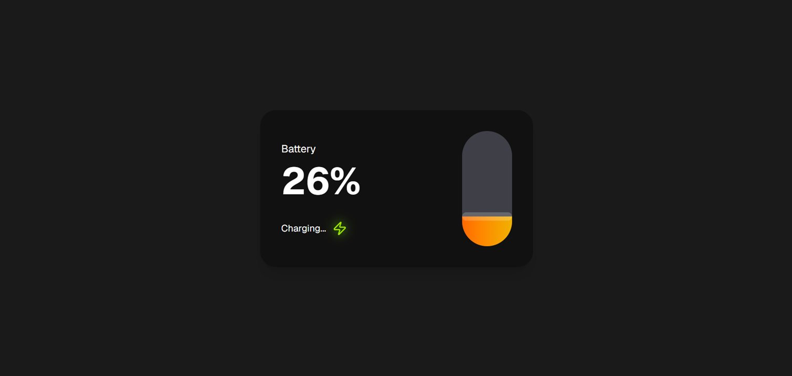

# 🔋 Battery Level Indicator

A simple Battery Level Indicator built using **React**, **Vite**, **Tailwind CSS**, and **shadcn/ui**.

## 📸 Screenshot

> Add your project screenshot here.





---

## ✨ Features

* Displays battery level
* Shows charging status
* Responsive design
* Clean UI

---

## 🛠️ Tech Stack

* React
* Vite
* Tailwind CSS
* shadcn/ui
* Lucide React

---

## 🚀 Installation

Clone the repository

```bash
git clone https://github.com/your-username/battery-level-indicator.git
```

Go to the project folder

```bash
cd battery-level-indicator
```

Install dependencies

```bash
npm install
```

Run the project

```bash
npm run dev
```

---

## 📦 Build

```bash
npm run build
```

---

## 👩‍💻 Author

**Srushti Malod**
